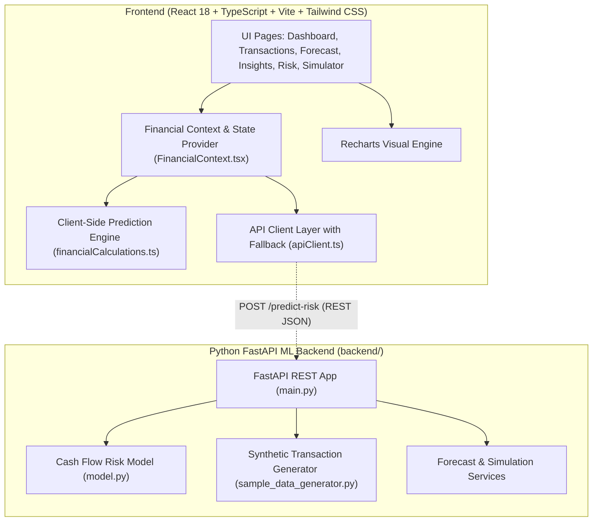

# CashFlow Guardian AI 🛡️

> **Predict cash shortages before they become business problems.**  
> An intelligent, hackathon-ready fintech product engineered for individuals, freelancers, startups, and small-to-medium businesses to forecast liquidity trajectories, detect cash deficit danger zones up to 60 days in advance, explain risk drivers via Explainable AI (XAI), and test financial scenarios dynamically.

[](https://github.com/purvabopche/CashFlow-Guardian-AI)
[](https://react.dev/)
[](https://fastapi.tiangolo.com/)
[](https://tailwindcss.com/)
[](https://recharts.org/)

---

## 1. Problem Statement

Over **82% of small businesses, freelancers, and growing ventures fail due to poor cash flow management and unexpected liquidity squeezes**:
- **Backward-Looking Tools**: Traditional accounting software (QuickBooks, Tally, spreadsheets) only tells you what already happened after money has already left the bank.
- **Receivables & Payment Lag**: Delayed customer settlements collide with fixed non-negotiable liabilities like rent, salaries, EMIs, and tax deadlines.
- **No Early Warning**: Business owners don't realize they will hit a cash deficit until 48 hours before an overdraft.
- **Inability to Stress-Test**: Answering simple questions like *"Can I afford to spend ₹5,000 more this week?"* or *"What if my salary is delayed by 5 days?"* requires fragile, complex spreadsheet formulas.

---

## 2. The Solution

**CashFlow Guardian AI** shifts cash management from **reactive bookkeeping** to **proactive predictive defense**:
1. **Continuous Rolling Forecast**: 30, 60, and 90-day time-series projections combining historical transaction velocity with forward commitments.
2. **Prominent Shortage Alerts & Danger Zones**: Flags exact deficit dates (e.g. *“Your balance may drop below ₹5,000 in 12 days on Sept 18”*).
3. **Cash Safety Score (0–100)**: Composite index assessing reserve cushion ratio, net burn velocity, recurring overhead, and discretionary elasticity.
4. **Explainable AI (XAI)**: SHAP-inspired feature attributions explaining *why* a risk level was assigned.
5. **Interactive What-If Simulator**: Real-time multi-slider stress testing for unexpected capex, payment delays, food/dining budget cuts, and revenue swings.
6. **1-Click AI Prescriptions**: Actionable recommendations with tailored payment reminder generators and discount waivers.

---

## 3. Product Structure & Key Pages

| Page / Section | Key Capabilities |
| :--- | :--- |
| 🛡️ **Dashboard** | Available liquid balance, monthly income, monthly expenses, net cash flow, upcoming recurring bills, Cash Safety Score (0–100), and prominent shortage alerts. |
| 📋 **Transactions** | Complete searchable ledger with category filters, income vs. expense toggles, recurring subscription badges, and discretionary spend tracking. |
| 📈 **Cash Flow Forecast** | Dual-axis time-series visualization displaying historical balances, forward projections, scheduled income/expense event markers, and highlighted **Danger Zone**. |
| 💡 **AI Guardian Insights** | Natural language, data-driven explanations (e.g. *“Your subscription payments account for 22% of expenses”*, *“Trim ₹300/day to boost safety score”*). |
| 🧠 **Risk Analysis (ML & XAI)** | Shortage probability %, confidence score, deficit window, and SHAP-based feature importance waterfall charts. |
| 🎛️ **What-If Simulator** | Dynamic real-time sliders and 1-click prompts (*Spend ₹5k more this week*, *5d salary delay*, *Cut food by 20%*, *Trim ₹300/day*) with live updates to safety score and forecast chart. |

---

## 4. System Architecture



---

## 5. Machine Learning & Predictive Risk Approach

CashFlow Guardian AI features a modular prediction architecture:
1. **Feature Engineering**:
   - Daily Outflow Burn Velocity ($/day or ₹/day)
   - Recurring Payment Concentration Ratio (`recurring_expenses / total_expenses`)
   - Reserve Headroom Ratio (`current_balance / safe_buffer_threshold`)
   - Receivables Aging Latency (`days_overdue` and `probability_of_delay`)
   - Discretionary Elasticity Ratio
2. **Survival Modeling & Probability Scoring**:
   - Computes cumulative survival curve across 30 days to predict the probability of cash balances breaching safety thresholds.
3. **Explainable AI (XAI)**:
   - Evaluates Shapley-inspired feature attributions to provide natural language explanations to the end user.
4. **FastAPI ML Endpoint**:
   - `POST /predict-risk` endpoint in `backend/main.py` accepting `current_balance`, `recent_transactions`, `recurring_payments`, and `expected_income`.
   - Returns `predicted_balance`, `shortage_probability`, `risk_level`, and human-friendly `explanation`.
   - **Graceful Fallback**: If the Python backend is offline, the React frontend seamlessly runs the client-side prediction engine.

---

## 6. Tech Stack

- **Frontend**: React 18, TypeScript, Vite 6, Tailwind CSS (Razorpay-inspired deep navy, emerald, and slate palette).
- **Icons**: Lucide React.
- **Charts**: Recharts (ComposedChart, AreaChart, BarChart, LineChart).
- **Backend**: Python 3.12, FastAPI, Pydantic v2, Uvicorn.
- **Data & ML**: NumPy, Pandas, Scikit-learn ready architecture.
- **Localization**: Native ₹ INR and $ USD currency formatting toggle.

---

## 7. Project Folder Structure

```
CashFlow-Guardian-AI/
├── .env.example                     # Environment configuration template
├── .gitignore                       # Git ignore rules
├── index.html                       # Entry HTML with Plus Jakarta Sans typography
├── package.json                     # NPM dependencies and scripts
├── postcss.config.js                # PostCSS config
├── tailwind.config.js               # Tailwind custom theme & color tokens
├── tsconfig.json                    # TypeScript compiler config
├── vite.config.ts                   # Vite bundler configuration
│
├── backend/                         # Python FastAPI ML Backend
│   ├── main.py                      # FastAPI server & POST /predict-risk endpoint
│   ├── model.py                     # ML Cash Flow Risk Model
│   ├── sample_data_generator.py     # Synthetic transaction stream generator
│   ├── requirements.txt             # Python dependencies
│   ├── README.md                    # Backend documentation
│   ├── models/schemas.py            # Pydantic data schemas
│   └── services/                    # ML and forecasting services
│
└── src/                             # Frontend React + TypeScript Application
    ├── main.tsx                     # React root
    ├── App.tsx                      # Root component with routing and modal mounts
    ├── index.css                    # Tailwind CSS directives
    │
    ├── types/
    │   └── financial.ts             # Domain models (Transactions, Invoices, Forecasts, Risk)
    │
    ├── data/
    │   └── mockFinancialData.ts     # Realistic Freelancer, Startup, and E-Com datasets
    │
    ├── utils/
    │   └── financialCalculations.ts # Calculation & prediction math engine
    │
    ├── services/
    │   └── apiClient.ts             # API client with FastAPI / Mock auto-switching
    │
    ├── context/
    │   └── FinancialContext.tsx     # Global state provider & currency formatter
    │
    ├── components/
    │   ├── common/                  # MetricCard, StatusBadge, ModelStatusBanner
    │   ├── layout/                  # Navbar with currency switch, Footer
    │   └── modals/                  # AddTransactionModal, InvoiceFollowUpModal, ExportReportModal
    │
    └── pages/
        ├── DashboardPage.tsx        # Dashboard with shortage alert, KPIs, and forecast
        ├── TransactionsPage.tsx     # Filterable transactions ledger & category analytics
        ├── ForecastPage.tsx         # 30/60/90d forecast with danger zone highlights
        ├── AiInsightsPage.tsx       # Natural language data-driven AI recommendations
        ├── RiskPredictionPage.tsx   # Shortage probability, XAI waterfall feature chart
        └── ScenarioSimulatorPage.tsx# Standout What-If simulator with interactive sliders
```

---

## 8. Installation & Running Instructions

### 1. Run the Frontend (React + TypeScript)
```bash
# Clone the repository
git clone https://github.com/purvabopche/CashFlow-Guardian-AI.git
cd CashFlow-Guardian-AI

# Install dependencies
npm install

# Start the Vite development server
npm run dev
```
Open **[http://localhost:3000](http://localhost:3000)** in your browser.

### 2. Run the Python FastAPI Backend (Optional)
```bash
cd backend

# Create and activate virtual environment
python -m venv venv
.\venv\Scripts\Activate.ps1   # On Windows
# source venv/bin/activate    # On macOS/Linux

# Install requirements
pip install -r requirements.txt

# Start FastAPI server
uvicorn main:app --reload --port 8000
```
Interactive API documentation will be available at:
- Swagger UI: **[http://localhost:8000/docs](http://localhost:8000/docs)**
- ReDoc: **[http://localhost:8000/redoc](http://localhost:8000/redoc)**

---

## 9. GitHub Repository

Project repository:
🔗 **[https://github.com/purvabopche/CashFlow-Guardian-AI](https://github.com/purvabopche/CashFlow-Guardian-AI)**

### Push Changes to GitHub
```bash
git add .
git commit -m "feat: complete CashFlow Guardian AI hackathon-grade implementation"
git push -u origin main
```

---

## 10. Future Improvements

- [ ] **Direct Open Banking & UPI Sync**: Account aggregator integration (Setu / OneMoney / Plaid) for automated transaction ingestion.
- [ ] **Autonomous AR Collections**: Automated WhatsApp and SMS payment reminders with integrated payment gateway links.
- [ ] **Working Capital Credit Bridge**: 1-click embedded credit lines when shortage probability exceeds 75%.
- [ ] **Multi-Account Treasury Optimization**: Smart cash distribution across high-yield savings and operational accounts.

---

### License
MIT License © 2026 CashFlow Guardian AI. Developed for Fintech Hackathons & SME Financial Resilience.
