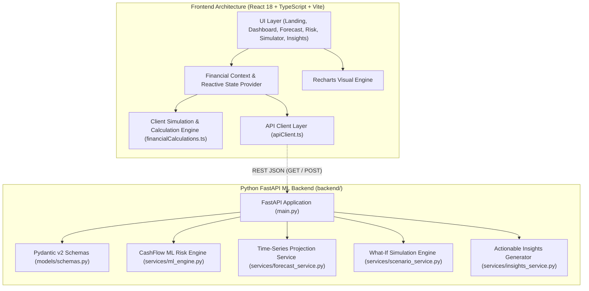

# CashFlow Guardian AI

> **Predict cash shortages before they become business problems.**  
> Next-generation predictive liquidity intelligence, Explainable AI (XAI) risk scoring, and interactive scenario simulation for small and medium businesses.

[](https://github.com/purvabopche/CashFlow-Guardian-AI)
[](https://react.dev/)
[](https://fastapi.tiangolo.com/)
[](https://tailwindcss.com/)
[](https://recharts.org/)

---

## 1. Project Overview

**CashFlow Guardian AI** is a production-ready, full-stack financial technology application built to protect small and medium enterprises (SMEs), SaaS startups, e-commerce brands, and agencies from sudden insolvency. By fusing real-time accounting telemetry, accounts receivable aging curves, and time-series cash burn modeling, the system predicts cash shortage windows up to 60 days in advance, explains the underlying risk drivers through Explainable AI (SHAP-inspired attribution), and provides 1-click corrective interventions.

---

## 2. Problem Statement

Over **82% of small business failures** are directly attributable to poor cash flow management and unexpected liquidity squeezes:
- **Backward-Looking Tools**: Traditional accounting software (QuickBooks, Xero, static spreadsheets) reports historical data after money has already left the bank.
- **Receivables Latency (Net-30/60 Delays)**: Clients delay payments unexpectedly, colliding with non-negotiable payroll and statutory tax deadlines.
- **Lack of Transparency**: Business owners cannot easily pinpoint which specific vendor commitment or overdue customer invoice triggered an overdraft.
- **Complex "What-If" Planning**: Testing financial scenarios in spreadsheets is fragile, slow, and prone to broken formulas.

---

## 3. The Solution

CashFlow Guardian AI shifts cash management from **reactive bookkeeping** to **proactive predictive defense**:
1. **Continuous Forecast Horizon**: Rolling 30, 60, and 90-day daily cash balance projections.
2. **Early Shortage Risk Detection**: Algorithmic probability calculation flagging exact deficit date windows (e.g., *Days 14–21*).
3. **Explainable AI (XAI)**: Identifies exactly *why* a risk score was assigned (e.g., +34% due to invoice lag, +26% due to payroll concentration).
4. **Dynamic What-If Simulator**: Real-time multi-slider stress testing for customer payment delays, capex surges, revenue swings, and vendor shifts.
5. **AI Financial Prescriptions**: 1-click tailored email reminders for overdue invoices with quick-pay discounts, vendor rescheduling guides, and expense rationalization checklists.

---

## 4. Key Features

| Feature | Description |
| :--- | :--- |
| 🛡️ **Financial Dashboard** | Live cash balances, monthly inflow/outflow velocity, 30-day projected balance, cash health score (0–100), and urgent risk banners. |
| 📈 **Cash Flow Forecast** | Dual-axis time-series visualization comparing closing balances against safe buffer thresholds with daily/weekly granularity and a transaction ledger. |
| 🧠 **Cash Shortage Risk & XAI** | Shortage probability gauge, confidence score, shortage window, and SHAP-based feature importance waterfall charts. |
| 🎛️ **What-If Scenario Simulator** | Dynamic sliders to perturb payment delays, unexpected lump expenses, revenue shifts, vendor timing, and safe buffer targets with instant visual recalculations. |
| 💡 **AI Financial Insights** | Prioritized actionable recommendations ranked by dollar impact ($) and runway extension (+days) with 1-click execution. |
| 🏢 **Multi-Industry Demo Datasets** | Instant toggling between SaaS Startup (*NovaScale*), E-Commerce Retail (*Lumina Goods*), and Creative Agency (*Kite Creative*). |
| ✉️ **1-Click Collection Accelerator** | Automated modal generating personalized payment reminder emails with optional 2% quick-pay settlement incentives. |
| 📄 **Executive Brief & CSV Export** | Export board-ready liquidity briefings and full ledger CSV datasets for audit and executive reporting. |

---

## 5. System Architecture



---

## 6. Machine Learning Model Integration Plan

CashFlow Guardian AI is built from the ground up to support production ML inference models.

### Target Model Architecture
1. **Time-Series Liquidity Forecasting**:
   - **Prophet / NeuralProphet**: Captures bi-weekly payroll seasonality (15th/30th) and month-end revenue lumpiness.
   - **Temporal Fusion Transformer (TFT)**: Multi-horizon forecasting with dynamic exogenous features (scheduled invoices and payments).
2. **Shortage Classification & Survival Modeling**:
   - **LightGBM / XGBoost Classifier**: Predicts binary probability of cash buffer breach within 30–60 days.
   - **Cox Proportional Hazards / Survival Analysis**: Models time-to-insolvency as a continuous survival curve.
3. **Explainable AI (XAI)**:
   - **TreeSHAP**: Computes exact Shapley values for each feature (receivable aging, payroll ratio, discretionary burn, revenue volatility).

### Backend Integration Hook
The Python backend in `backend/services/ml_engine.py` is structured with clean interfaces to swap the heuristic baseline with serialized model weights (`.joblib`, `.onnx`, or PyTorch checkpoints):

```python
# backend/services/ml_engine.py
class CashFlowMLEngine:
    def __init__(self):
        # Load trained weights:
        # self.model = joblib.load("models/xgboost_cash_survival.joblib")
        # self.explainer = shap.TreeExplainer(self.model)
        pass

    def predict_shortage_risk(self, features):
        # shap_values = self.explainer.shap_values(features)
        # return RiskPrediction(...)
```

---

## 7. Tech Stack

### Frontend
- **Framework**: React 18 with TypeScript
- **Build Tool**: Vite 6
- **Styling**: Tailwind CSS with custom fintech palette (Deep Navy `#0B132B`, Emerald `#10B981`, Slate)
- **Icons**: Lucide React
- **Charts**: Recharts (Area, Composed, Line, and Bar charts)
- **Animations & Micro-interactions**: Tailwind keyframes & Canvas Confetti

### Backend & ML Service
- **Framework**: FastAPI (Async Python 3.12)
- **Data Validation**: Pydantic v2
- **Server**: Uvicorn ASGI
- **Data & Scientific Computing**: NumPy, Pandas, Scikit-learn ready

---

## 8. Project Folder Structure

```
CashFlow-Guardian-AI/
├── .env.example                     # Environment variable template
├── .gitignore                       # Git ignore configuration
├── index.html                       # HTML entry point with Plus Jakarta Sans typography
├── package.json                     # NPM project dependencies and scripts
├── postcss.config.js                # PostCSS configuration
├── tailwind.config.js               # Tailwind custom theme & color tokens
├── tsconfig.json                    # TypeScript compiler configuration
├── tsconfig.node.json               # TypeScript Node configuration
├── vite.config.ts                   # Vite bundler configuration
│
├── backend/                         # Python FastAPI ML Backend Service
│   ├── main.py                      # FastAPI app entry point & REST endpoints
│   ├── README.md                    # Backend documentation & quickstart
│   ├── requirements.txt             # Python dependencies
│   ├── models/
│   │   └── schemas.py               # Pydantic data contracts
│   └── services/
│       ├── ml_engine.py             # ML Risk & Explainable AI inference engine
│       ├── forecast_service.py      # Time-series projection calculations
│       ├── scenario_service.py      # What-If Monte Carlo/deterministic simulator
│       └── insights_service.py      # Prescriptive financial recommendations
│
└── src/                             # Frontend React + TypeScript Application
    ├── main.tsx                     # React application entry
    ├── App.tsx                      # Root component with routing and modal mounts
    ├── index.css                    # Tailwind directives and custom scrollbars
    │
    ├── types/
    │   └── financial.ts             # Core domain TypeScript models & schemas
    │
    ├── data/
    │   └── mockFinancialData.ts     # Realistic SaaS, E-Com, and Agency datasets
    │
    ├── utils/
    │   └── financialCalculations.ts # Client-side math & forecasting engine
    │
    ├── services/
    │   └── apiClient.ts             # Unified API client (Mock / FastAPI live switch)
    │
    ├── context/
    │   └── FinancialContext.tsx     # Global financial state & dataset provider
    │
    ├── components/
    │   ├── common/
    │   │   ├── MetricCard.tsx       # KPI card with trends and tooltips
    │   │   ├── StatusBadge.tsx      # Risk and urgency badges
    │   │   └── ModelStatusBanner.tsx# ML pipeline transparency banner
    │   ├── layout/
    │   │   ├── Navbar.tsx           # Navigation bar with dataset switcher
    │   │   └── Footer.tsx           # Footer with disclosures and repo link
    │   └── modals/
    │       ├── AddTransactionModal.tsx  # Add custom inflow/payment modal
    │       ├── InvoiceFollowUpModal.tsx # AI reminder email generator modal
    │       └── ExportReportModal.tsx    # CSV & Executive Briefing export modal
    │
    └── pages/
        ├── LandingPage.tsx          # Hero section, value proposition, feature matrix
        ├── DashboardPage.tsx        # KPI metrics, 30-day forecast, payment ledgers
        ├── ForecastPage.tsx         # 30/60/90d forecast, buffer lines, table
        ├── RiskPredictionPage.tsx   # Shortage probability, XAI waterfall attribution
        ├── ScenarioSimulatorPage.tsx# Dynamic multi-slider What-If simulator
        └── AiInsightsPage.tsx       # Actionable prioritized recommendation cards
```

---

## 9. Installation and Setup Instructions

### Prerequisites
- **Node.js**: v18.0.0 or higher (v22 recommended)
- **npm**: v9.0.0 or higher
- **Python**: v3.10 or higher (optional, for backend service)
- **Git**: Installed and configured

### Clone the Repository
```bash
git clone https://github.com/purvabopche/CashFlow-Guardian-AI.git
cd CashFlow-Guardian-AI
```

---

## 10. How to Run the Frontend

1. **Install Dependencies**:
   ```bash
   npm install
   ```

2. **Configure Environment Variables (Optional)**:
   ```bash
   # Copy example environment configuration
   cp .env.example .env
   ```

3. **Start the Vite Development Server**:
   ```bash
   npm run dev
   ```

4. **Access the Application**:
   Open [http://localhost:3000](http://localhost:3000) in your browser.

5. **Build for Production**:
   ```bash
   npm run build
   ```

---

## 11. How to Run the Python FastAPI Backend

1. **Navigate to the Backend Directory**:
   ```bash
   cd backend
   ```

2. **Create and Activate a Virtual Environment**:
   ```bash
   # On Windows (PowerShell):
   python -m venv venv
   .\venv\Scripts\Activate.ps1

   # On macOS / Linux:
   python3 -m venv venv
   source venv/bin/activate
   ```

3. **Install Python Dependencies**:
   ```bash
   pip install -r requirements.txt
   ```

4. **Start the FastAPI Server**:
   ```bash
   uvicorn main:app --reload --port 8000
   ```

5. **Access Interactive API Docs**:
   - Swagger UI: [http://localhost:8000/docs](http://localhost:8000/docs)
   - ReDoc: [http://localhost:8000/redoc](http://localhost:8000/redoc)

6. **Connect Frontend to Live Backend**:
   Set `VITE_USE_MOCK_API=false` in `.env` and restart the frontend dev server.

---

## 12. API Integration Details

| Method | Endpoint | Description |
| :--- | :--- | :--- |
| `GET` | `/api/health` | ML inference engine health and model status check |
| `GET` | `/api/datasets` | Retrieve available demo business profiles |
| `GET` | `/api/financial-summary` | Current balance, runway, cash health score (0–100) |
| `GET` | `/api/forecast` | 30/60/90-day time-series projected balance & flow rates |
| `GET` | `/api/risk-prediction` | Shortage probability, confidence score, and XAI feature impacts |
| `POST`| `/api/simulate` | Dynamic multi-variable What-If simulation engine |
| `GET` | `/api/insights` | Actionable recommendations with quantified dollar impact |

---

## 13. Future Scope

- [ ] **Direct Open Banking & Plaid Sync**: Real-time automated transaction sync across 12,000+ financial institutions.
- [ ] **Accounting Software Integrations**: Native 1-click connectors for QuickBooks Online, Xero, Stripe Billing, and NetSuite.
- [ ] **Autonomous AR Collection Workflows**: Automated multi-channel SMS and email escalation sequences with payment gateway links.
- [ ] **Dynamic Working Capital Financing**: Integrated embedded lending marketplace offering bridge credit when shortage risk exceeds 80%.
- [ ] **Multi-Currency Support**: FX hedging recommendations for cross-border e-commerce brands.

---

## 14. GitHub Repository

This project is connected and maintained at:
🔗 **[https://github.com/purvabopche/CashFlow-Guardian-AI](https://github.com/purvabopche/CashFlow-Guardian-AI)**

---

### License
MIT License © 2026 CashFlow Guardian AI Contributors.
