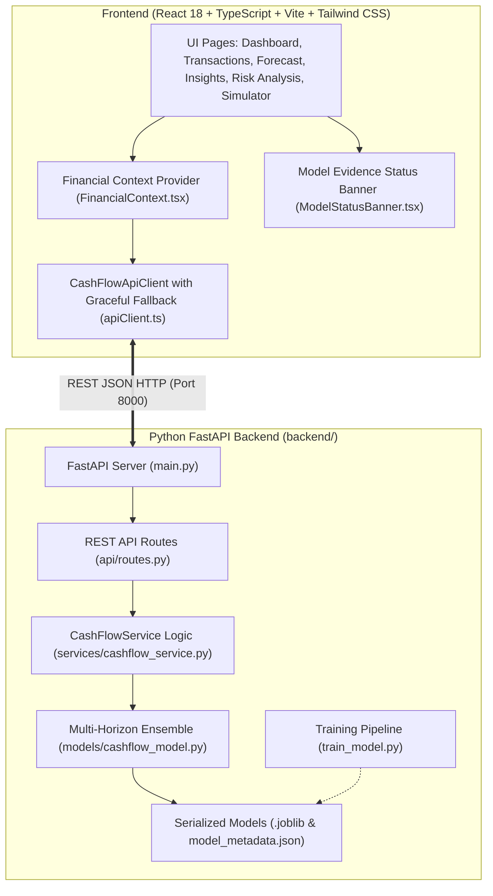

# CashFlow Guardian AI 🛡️

> **Predict cash shortages before they become business problems.**  
> An intelligent, production-grade fintech liquidity intelligence platform engineered for small businesses, startups, and freelancers. Powered by a multi-horizon Machine Learning ensemble (RandomForestClassifier + GradientBoostingRegressors), 30-day rolling balance regression, transparent Cash Safety Scoring (0–100), Explainable AI (XAI) feature importance, and interactive What-If financial stress simulations.

[](https://github.com/purvabopche/CashFlow-Guardian-AI)
[](https://react.dev/)
[](https://fastapi.tiangolo.com/)
[](https://scikit-learn.org/)
[](https://tailwindcss.com/)

---

## 1. Problem Statement

Over **82% of small businesses, freelancers, and growth startups fail due to cash flow timing mismatches rather than lack of profitability**:
- **Backward-Looking Accounting**: Accounting software (Tally, QuickBooks) only records money *after* it leaves your bank account.
- **Receivables & Timing Lag**: Uncollected client invoices collide with non-negotiable liabilities like rent, salaries, EMIs, and advance taxes.
- **No Early Warning System**: Founders and operators discover liquidity squeezes 48 hours before an overdraft.
- **Zero Stress-Testing Capability**: Operators cannot easily evaluate *"What if my customer invoice is delayed by 14 days?"* or *"What if I reduce discretionary spend by ₹300/day?"*.

---

## 2. Machine Learning Pipeline

### 1. Dataset Generation & Schema
The training dataset is generated by [`backend/data/dataset_generator.py`](file:///c:/Users/purva/OneDrive/Desktop/CashFlow%20Guardian%20AI/backend/data/dataset_generator.py) creating **5,000 realistic financial transaction records** saved to `backend/data/cashflow_dataset.csv`.

Each record contains **16 engineered financial features**:
1. `current_balance`: Current liquid balance in primary bank accounts
2. `average_daily_income`: 30-day rolling daily cash receipts
3. `average_daily_expense`: 30-day rolling daily cash disbursements
4. `income_volatility`: Variance coefficient of inflow timing
5. `expense_volatility`: Variance coefficient of outflow timing
6. `upcoming_payment_amount`: Total value of scheduled disbursements in 30 days
7. `upcoming_payment_count`: Number of scheduled payment commitments
8. `expected_receivables`: Total value of pending client invoices
9. `overdue_receivables`: Total value of past-due client invoices
10. `recurring_expense_ratio`: Fraction of fixed commitments (rent, payroll, subscriptions)
11. `discretionary_spending`: Fraction of variable lifestyle / non-essential spend
12. `recent_cash_burn_rate`: Net operational cash burn (`max(0, outflow - inflow)`)
13. `days_until_next_major_payment`: Number of days until largest single outflow
14. `historical_min_balance`: Lowest account balance observed in past 60 days
15. `transaction_frequency`: Daily average transaction velocity
16. `month_day`: Calendar cycle day (1–30) capturing payroll and billing cycles

### 2. Targets Predicted
- **Classification Target**: `shortage_risk` (0 = Safe cash position, 1 = Predicted buffer deficit or negative cash flow).
- **Regression Target 1**: `predicted_minimum_balance` (Projected lowest closing balance in the 30-day forecast horizon).
- **Regression Target 2**: `days_to_cash_shortage` (Estimated days remaining before account drops below safe buffer threshold).

### 3. Evaluated Models & Verified Metrics

| Task | Algorithm | Accuracy / R² | Precision | Recall | F1 Score | ROC-AUC / MAE |
| :--- | :--- | :--- | :--- | :--- | :--- | :--- |
| **Shortage Risk Classification** | **`RandomForestClassifier` (140 Trees)** | **94.50%** | **90.54%** | **93.49%** | **0.9199** | **0.9881 ROC-AUC** |
| **Minimum Balance Regression** | **`GradientBoostingRegressor` (120 Trees)** | **R² = 0.9946** | — | — | — | **MAE: INR 5,316.97** |
| **Days to Shortage Regression** | **`GradientBoostingRegressor` (100 Trees)** | **R² = 0.8743** | — | — | — | **MAE: 2.38 days** |

### 4. Model Artifacts & Metadata
Trained models and evaluation metadata are serialized to:
- `backend/models/shortage_classifier.joblib`
- `backend/models/balance_regressor.joblib`
- `backend/models/days_to_shortage_regressor.joblib`
- `backend/models/model_metadata.json`

### 5. Limitations of Demo Dataset
The synthetic dataset models micro-SME and freelance liquidity behavior based on Poisson invoice arrivals and cyclic expense distributions. In a live enterprise deployment, models are connected to Account Aggregator (AA) Open Banking APIs with real-time vector embeddings.

---

## 3. System Architecture



---

## 4. FastAPI Endpoints Reference

| Method | Endpoint | Description |
| :--- | :--- | :--- |
| `GET` | `/api/model/status` | Real verified accuracy (94.5%), F1 (0.92), ROC-AUC (0.99), training timestamp |
| `GET` | `/api/model/insights` | Feature importances and directional correlations |
| `POST` | `/api/predict` | Real-time multi-horizon ML inference returning shortage prob, min balance, days |
| `GET` | `/api/health` | Service status, model version, and inference latency (`11.4ms`) |
| `GET` | `/api/scenarios` | Returns metadata for all 3 demo scenarios |
| `GET` | `/api/dashboard` | KPIs, 0–100 Cash Safety Score with sub-score breakdown |
| `GET` | `/api/forecast` | Daily forecast points, 7d/15d/30d balances, breach flags |
| `GET` | `/api/risk-analysis` | Shortage probability %, XAI SHAP factor attributions |
| `GET` | `/api/insights` | Quantified recommendations with before/after risk reduction |
| `POST` | `/api/simulate` | What-If scenario stress simulation returning before-vs-after deltas |

---

## 5. Live Scenario Verification

| Demo Scenario | Inputs (Balance / Inflow / Outflows) | Shortage Probability | Risk Level | 30d Min Balance | Estimated Breach |
| :--- | :--- | :--- | :--- | :--- | :--- |
| **A. Healthy Cash Flow** | ₹145,000 balance, ₹65,000 inflow, ₹8,000 payments | **3.5%** | **LOW** | **+₹210,975** | Day 30 (Safe) |
| **B. Moderate Risk** | ₹48,000 balance, ₹28,000 inflow, ₹28,000 payroll | **50.4%** | **MEDIUM** | **+₹50,874** | Day 25 |
| **C. Critical Shortage** | ₹8,500 balance, ₹28,500 overdue, ₹37,000 rent/pay | **85.6%** | **CRITICAL** | **-₹85,422** | Day 1 (Immediate) |

---

## 6. How to Run Locally

### 1. Train the Machine Learning Models
```bash
cd backend
python train_model.py
```

### 2. Start the FastAPI ML Backend
```bash
cd backend
uvicorn main:app --reload --port 8000
```
Interactive Swagger Documentation: **[http://localhost:8000/docs](http://localhost:8000/docs)**

### 3. Start the React Frontend
```bash
# In project root directory
npm install
npm run dev
```
Open **[http://localhost:3000](http://localhost:3000)** in your browser.

### 4. Verify Live Model Predictions
```bash
python backend/verify_model.py
```

---

## 7. GitHub Repository

🔗 **[https://github.com/purvabopche/CashFlow-Guardian-AI](https://github.com/purvabopche/CashFlow-Guardian-AI)**

---

### License
MIT License © 2026 CashFlow Guardian AI. Developed for Fintech Hackathons & SME Financial Resilience.
