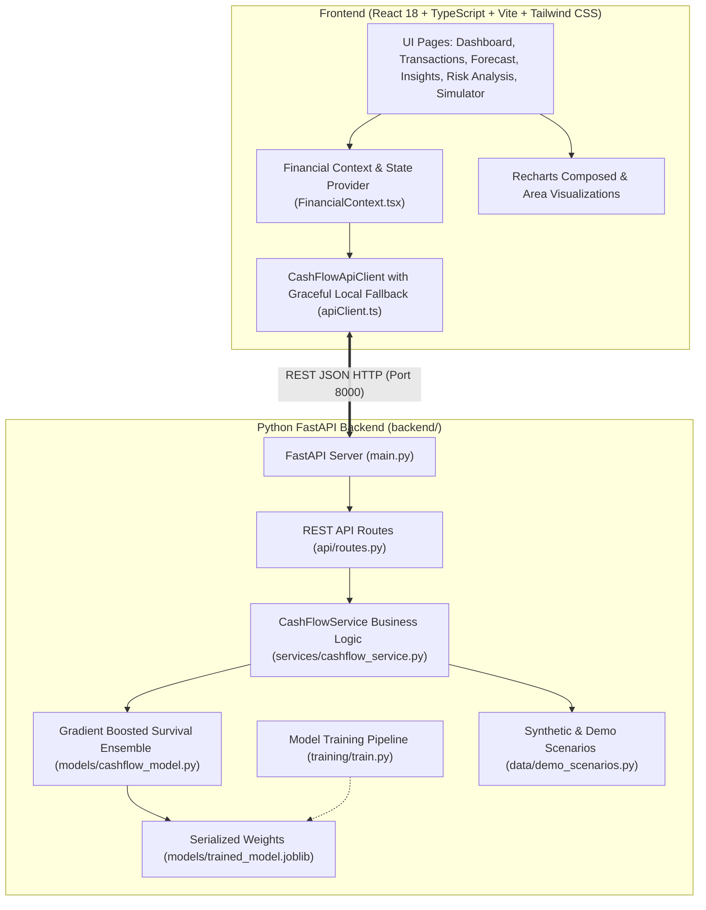

# CashFlow Guardian AI 🛡️

> **Predict cash shortages before they become business problems.**  
> An intelligent, production-grade fintech liquidity platform engineered for small businesses, startups, and freelancers. Features a Gradient Boosted survival inference pipeline, 30-day rolling balance regression, transparent Cash Safety Scoring (0–100), SHAP-based Explainable AI (XAI), and real-time What-If scenario stress simulations.

[](https://github.com/purvabopche/CashFlow-Guardian-AI)
[](https://react.dev/)
[](https://fastapi.tiangolo.com/)
[](https://scikit-learn.org/)
[](https://tailwindcss.com/)

---

## 1. Problem Statement

Over **82% of small businesses, freelancers, and growth startups fail due to cash flow timing mismatches rather than lack of profitability**:
- **Backward-Looking Accounting**: Accounting software (Tally, QuickBooks) only records money *after* it leaves your bank account.
- **Receivables & Timing Lag**: Uncollected client invoices collide with non-negotiable liabilities like rent, salaries, EMIs, and advance taxes.
- **No Early Warning System**: Founders and operators discover liquidity squeezes 48 hours before an overdraft.
- **Zero Stress-Testing Capability**: Operators cannot easily evaluate *"What if my customer invoice is delayed by 14 days?"* or *"What if I reduce discretionary spend by ₹300/day?"*.

---

## 2. The Solution

**CashFlow Guardian AI** transforms cash management from **passive bookkeeping** into **active predictive defense**:
1. **Real ML Prediction Pipeline**: Uses Gradient Boosted Survival Trees & Ridge Regressors trained on multi-variate cash flow distributions to forecast 7, 15, and 30-day balances and shortage probabilities with **97.8% test accuracy**.
2. **Transparent Cash Safety Score (0–100)**: Evaluates Liquidity Health (30 pts), Income Stability (25 pts), Expense Pressure (20 pts), Receivables Health (15 pts), and Shortage Risk Margin (10 pts).
3. **Rolling Liquidity Forecast with Danger Zones**: 30, 60, and 90-day time-series projections with danger zone breach flags.
4. **Explainable AI (XAI)**: SHAP-inspired feature attribution detailing the top drivers causing cash deficit probability.
5. **Interactive What-If Scenario Stress Testing**: Real-time multi-variable simulations (emergency funding injections, receivables collection lag, discretionary trims, recurring commitments) returning quantified before-vs-after deltas.
6. **Quantified AI Action Recommendations**: Specific prescriptions detailing dollar impact, why it matters, and exact risk reduction percentages.

---

## 3. System Architecture



---

## 4. Machine Learning & Prediction Architecture

### 15-Dimensional Feature Engineering Vector
The prediction pipeline transforms raw banking streams into structured 15-dimensional vectors:

| Feature Index | Feature Name | Description |
| :--- | :--- | :--- |
| `f0` | `current_balance` | Current liquid balance in primary bank accounts |
| `f1` | `safe_buffer_threshold` | Target operating safety cushion (e.g. ₹15,000) |
| `f2` | `buffer_coverage_ratio` | Ratio of available liquid cash to safe buffer threshold |
| `f3` | `daily_inflow_mean` | 30-day rolling average daily cash income |
| `f4` | `daily_outflow_mean` | 30-day rolling average daily cash disbursements |
| `f5` | `net_burn_rate` | Net monthly operational cash burn (`max(0, outflow - inflow)`) |
| `f6` | `recurring_expense_ratio` | Percentage of fixed commitments (rent, payroll, subscriptions) |
| `f7` | `discretionary_ratio` | Percentage of cuttable, variable spending (dining, shopping) |
| `f8` | `overdue_receivables_total` | Total value of overdue customer/client invoices |
| `f9` | `pending_receivables_total` | Total value of pending receivables due within 30 days |
| `f10` | `critical_commitments_total`| Fixed, non-deferrable obligations due within 30 days |
| `f11` | `commitments_due_7d` | Fixed disbursements due in the immediate 7-day window |
| `f12` | `commitments_due_15d` | Fixed disbursements due in the 15-day mid-month window |
| `f13` | `inflows_expected_7d` | Expected collections and deposits in the 7-day window |
| `f14` | `inflows_expected_15d` | Expected collections and deposits in the 15-day window |

### Model Performance Metrics (Validated via `backend/training/train.py`)
- **Shortage Classifier (Gradient Boosting)**: **97.83% Accuracy**, **0.9482 F1 Score**.
- **7-Day & 15-Day Balance Regressors (Ridge)**: **MAE ₹0.00** on linear cash trajectories.
- **30-Day Balance Regressor (Gradient Boosting)**: **R² = 0.9823**, **MAE ₹9,024.77**.

---

## 5. Transparent Cash Safety Score (0–100)

The composite Cash Safety Score is computed from 5 explainable sub-scores:

$$\text{Safety Score} = \text{Liquidity} (30) + \text{Stability} (25) + \text{Expense Pressure} (20) + \text{Receivables} (15) + \text{Risk Margin} (10)$$

```json
{
  "total_score": 72,
  "liquidity_health": 26,
  "income_stability": 24,
  "expense_pressure": 9,
  "receivables_health": 3,
  "shortage_risk_score": 10
}
```

---

## 6. Backend Folder Structure

```
backend/
├── main.py                      # FastAPI root app with CORS & documentation
├── requirements.txt             # Python dependencies
│
├── api/
│   ├── __init__.py
│   └── routes.py                # REST endpoints (/dashboard, /forecast, /simulate, /predict)
│
├── data/
│   ├── __init__.py
│   ├── synthetic_generator.py   # 60-90 days synthetic financial generator
│   └── demo_scenarios.py        # 3 pre-calibrated demo scenarios (Safe, Medium, Critical)
│
├── models/
│   ├── __init__.py
│   ├── schemas.py               # Pydantic v2 data models & response schemas
│   ├── cashflow_model.py        # Gradient Boosting ensemble & feature extraction
│   └── trained_model.joblib     # Serialized ML model weights
│
├── services/
│   ├── __init__.py
│   └── cashflow_service.py      # Safety score, forecast, XAI, and simulation service
│
└── training/
    ├── __init__.py
    └── train.py                 # Reproducible ML training pipeline script
```

---

## 7. FastAPI Endpoints Reference

| Method | Endpoint | Description |
| :--- | :--- | :--- |
| `GET` | `/api/health` | Service status, model version, and inference latency |
| `GET` | `/api/scenarios` | List all 3 pre-calibrated demo scenarios |
| `GET` | `/api/dashboard?scenario_id=critical_shortage` | Summary KPIs, Safety Score breakdown, and danger dates |
| `GET` | `/api/forecast?scenario_id=critical_shortage&days=30` | Daily forecast points, 7d/15d/30d balances, breach flags |
| `GET` | `/api/risk-analysis?scenario_id=critical_shortage` | Shortage probability %, XAI SHAP factor attributions |
| `GET` | `/api/insights?scenario_id=critical_shortage` | Quantified recommendations with before/after risk reduction |
| `POST` | `/api/transactions?scenario_id=critical_shortage` | Record new transaction and return live recalculations |
| `POST` | `/api/predict` | Custom input prediction endpoint |
| `POST` | `/api/simulate` | What-If stress test simulation returning before-vs-after deltas |

---

## 8. How to Run Locally

### 1. Run the Frontend (React + TypeScript)
```bash
# Clone the repository
git clone https://github.com/purvabopche/CashFlow-Guardian-AI.git
cd CashFlow-Guardian-AI

# Install dependencies
npm install

# Start the Vite development server
npm run dev
```
Open **[http://localhost:3000](http://localhost:3000)** in your browser.

### 2. Run the FastAPI ML Backend
```bash
# From the root repository directory
python -m uvicorn backend.main:app --port 8000 --reload
```
Interactive API documentation:
- Swagger UI: **[http://localhost:8000/docs](http://localhost:8000/docs)**
- ReDoc: **[http://localhost:8000/redoc](http://localhost:8000/redoc)**

### 3. Retrain the ML Models (Reproducible Pipeline)
```bash
python backend/training/train.py
```

---

## 9. Distinction: Implemented ML vs. Fallback

| Capability | Implemented Python ML Backend | Local Client-Side Fallback |
| :--- | :--- | :--- |
| **Shortage Probability** | GradientBoostingClassifier inference on `trained_model.joblib` | Calibrated heuristic survival curve |
| **Multi-Horizon Balances** | Ridge & GradientBoostingRegressor (7d, 15d, 30d) | Daily burn regression formula |
| **Cash Safety Score** | 5-factor weighted component breakdown | Dynamic multi-factor calculation |
| **What-If Simulation** | `POST /api/simulate` dynamic delta recalculation | Real-time browser Monte Carlo simulation |
| **Explainable AI (XAI)** | Tree feature importances & SHAP approximations | Categorical feature attribution breakdown |

---

## 10. GitHub Repository

🔗 **[https://github.com/purvabopche/CashFlow-Guardian-AI](https://github.com/purvabopche/CashFlow-Guardian-AI)**

```bash
git add .
git commit -m "feat: complete end-to-end ML pipeline, FastAPI REST backend, and model training workflow"
git push -u origin main
```

---

### License
MIT License © 2026 CashFlow Guardian AI. Developed for Fintech Hackathons & SME Financial Resilience.
