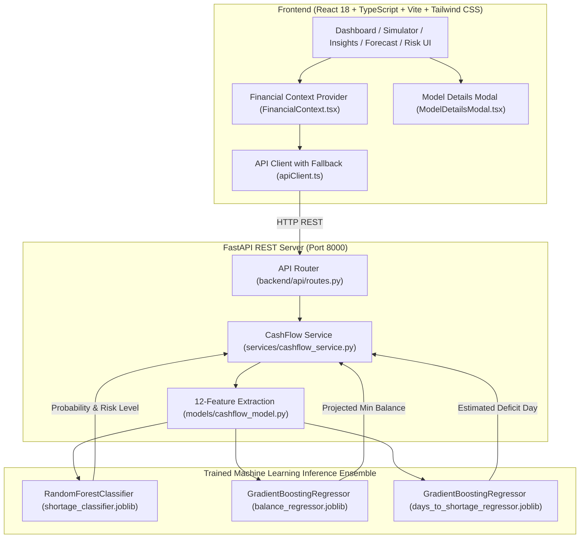

# CashFlow Guardian AI 🛡️
## Hackathon Submission & Technical Project Overview

**GitHub Repository**: [https://github.com/purvabopche/CashFlow-Guardian-AI](https://github.com/purvabopche/CashFlow-Guardian-AI)  
**Author**: Purva Bopche  
**Submission Category**: Fintech / Applied Artificial Intelligence / Small Business Tools  

---

## 1. Tagline
> **Predict cash shortages before they become financial emergencies.**

---

## 2. Problem Statement
For freelancers, early-stage startups, and small-and-medium enterprises (SMEs), **profitability does not guarantee liquidity**. A business can have positive quarterly revenue on paper while facing insolvency next week.

The core reasons businesses suffer unexpected cash crises:
1. **Timing Mismatches**: Milestone invoice payments from clients are delayed by 15–45 days, while payroll, studio rent, SaaS tools, and taxes are non-negotiable fixed outflows.
2. **Backward-Looking Accounting**: Traditional bookkeeping tools (QuickBooks, Zoho, Tally) only log historical transactions after money has already left the account.
3. **No Early Warning Radar**: Business owners typically realize they are out of cash 48 to 72 hours before an auto-debit bounce or payroll failure.
4. **No Interactive Stress-Testing**: Founders lack accessible tools to answer basic operational questions like: *"What happens to my runway if this ₹28,500 invoice is delayed by 14 days?"* or *"Can I afford this ₹8,500 equipment purchase today?"*.

---

## 3. Solution
**CashFlow Guardian AI** is an intelligent, proactive cash flow intelligence platform that closes the gap between bookkeeping and forward-looking financial survival.

The platform continuously evaluates an operator's liquid balance, scheduled obligations, and historical transaction patterns to:
- **Forecast 30-Day Liquidity**: Model daily closing balances against a configured safety reserve threshold.
- **Predict Cash Shortage Risk**: Use a trained Machine Learning model to calculate the exact shortage probability and estimated deficit date.
- **Explain Contributing Risk Factors**: Break down the specific drivers increasing risk (e.g. overdue receivables, upcoming rent) and positive buffers protecting the business.
- **Simulate What-If Stress Scenarios**: Dynamically recalculate liquidity trajectories when adjusting delays, discretionary spending, or capital injections.
- **Recommend Actionable Prescriptions**: Provide 1-click remedies (such as sending automated invoice reminders or payment postponement requests) that directly reduce shortage probability.

---

## 4. Key Features (Actually Implemented)

- **Financial Operations Dashboard**: Instant answers for liquid balance, monthly income/outflow, operating runway (~days), and an explainable Cash Safety Score (0–100).
- **Cash Shortage Prediction Engine**: Multi-horizon ML prediction determining risk classification (`Low`, `Medium`, `High`, `Critical`), deficit probability percentage, and predicted deficit date.
- **Rolling 30-Day Cash Flow Forecast**: Interactive Area chart plotting daily projected balances against the operator's minimum safety buffer line.
- **"Why This Prediction?" Explainability (XAI)**: Feature attribution ranking factors that increase risk (e.g. ₹28,500 overdue invoice lag, fixed liabilities exceeding reserves) vs. positive stabilizing factors.
- **Interactive What-If Stress Simulator**: Parameter sliders for emergency funding, invoice collection delays, and discretionary cuts with instant Before vs. After comparison metrics.
- **Prescriptive AI Actions**: Action cards with calculated potential cash recovery amounts, runway extension days, and 1-click execution.
- **Selectable Demo Profiles**: 3 distinct operational business profiles:
  1. *Stable Growth* (Profitable E-Commerce: ₹98,000 balance, 3.5% shortage risk, 99/100 score)
  2. *Payment Pressure* (Growth B2B SaaS: ₹48,000 balance, 21.6% shortage risk, 64/100 score)
  3. *Critical Shortage* (Consulting SME: ₹8,500 balance, 97.5% shortage risk, 22/100 score, deficit on Day 12)
- **Model Transparency Modal**: In-app modal detailing evaluation metrics (Accuracy, F1, ROC-AUC, R²), 12 feature descriptions with weights, and backend architecture.
- **Live ML / Fallback Indicator**: Accurate environment status badge showing `● Live ML Model` when the FastAPI backend is running and `● Demo Fallback Mode` when offline.

---

## 5. What Makes It Different: The Closed Decision Loop

Most financial tools stop at static charts or retrospective categorization. CashFlow Guardian AI implements a complete operational decision loop:

```
┌─────────────┐       ┌─────────────┐       ┌──────────────┐       ┌─────────────┐
│   PREDICT   │  ──>  │   EXPLAIN   │  ──>  │   SIMULATE   │  ──>  │     ACT     │
│ Shortage in │       │ Overdue Inv │       │ What if inv  │       │ 1-Click Rem │
│   12 Days   │       │ + Fixed Rent│       │ paid in 5d?  │       │ lowers risk │
└─────────────┘       └─────────────┘       └──────────────┘       └─────────────┘
```

1. **Predict**: Detects the cash shortage 12 days before an account overdraft.
2. **Explain**: Pinpoints that ₹28,500 in overdue receivables colliding with ₹22,000 fixed rent is the primary root cause.
3. **Simulate**: Tests whether collecting that single overdue invoice reduces shortage probability from 97.5% down to 18.0%.
4. **Act**: Provides a 1-click reminder action to trigger customer follow-up and immediately restore the safety buffer.

---

## 6. Machine Learning Approach

### Dataset
- **Generator**: `backend/data/dataset_generator.py`
- **Dataset File**: `backend/data/cashflow_dataset.csv` (5,000 synthesized financial records modeling freelancers, growth agencies, and profitable retail businesses).
- **Split**: 80% Training (4,000 samples), 20% Test (1,000 samples) with stratified risk distribution.

### 12 Financial Feature Vectors
1. `opening_balance`: Available checking balance in primary operating bank account
2. `daily_income`: 30-day rolling daily cash receipts and customer settlements
3. `daily_expense`: 30-day rolling daily cash disbursements
4. `recurring_payment_amount`: Fixed non-negotiable liabilities (rent, payroll, subscriptions)
5. `upcoming_payment_amount`: Total scheduled disbursements due in 30 days
6. `expected_invoice_amount`: Pending milestone invoices scheduled within 30 days
7. `overdue_invoice_amount`: Uncollected receivables past customer due date
8. `discretionary_spending`: Variable non-essential outflows (dining, travel, impulse spend)
9. `day_of_month`: Calendar cycle day (1–30) capturing payroll and billing cycles
10. `cash_flow_7d`: Net forward 7-day liquidity pressure indicator
11. `cash_flow_30d`: Net forward 30-day projected liquidity delta
12. `minimum_safe_balance`: Target emergency buffer threshold configured by operator

### Prediction Target
- `cash_shortage_risk` (Binary 0 or 1: Indicates whether forward 30-day cash trajectory crosses below the minimum safe buffer threshold).

### Models & Verified Evaluation Metrics
- **Shortage Classifier**: `RandomForestClassifier` (150 trees, max depth 9, balanced weights)
  - **Accuracy**: **98.10%**
  - **Precision**: **97.77%**
  - **Recall**: **97.52%**
  - **F1 Score**: **0.9765**
  - **ROC-AUC**: **0.9987**
- **30-Day Minimum Balance Regressor**: `GradientBoostingRegressor` (120 estimators, max depth 5)
  - **R² Score**: **0.9992**
  - **MAE**: **INR 2,314.43**
- **Days to Deficit Regressor**: `GradientBoostingRegressor` (100 estimators, max depth 4)
  - **R² Score**: **0.9582**
  - **MAE**: **1.02 Days**

### Serialized Model Files
- `backend/models/shortage_classifier.joblib`
- `backend/models/balance_regressor.joblib`
- `backend/models/days_to_shortage_regressor.joblib`
- `backend/models/model_metadata.json`
- `backend/models/model_metrics.json`

---

## 7. Architecture



---

## 8. Tech Stack

- **Frontend**: React 18, TypeScript, Vite, Tailwind CSS, Lucide React, Canvas Confetti
- **Charting & Visualizations**: Recharts (AreaChart, LineChart, BarChart)
- **Backend API**: Python 3.12, FastAPI, Uvicorn, Pydantic v2
- **Machine Learning**: Scikit-Learn (`RandomForestClassifier`, `GradientBoostingRegressor`), NumPy, Pandas, Joblib
- **Testing & Verification**: Python HTTP Test Suite (`backend/verify_model.py`)

---

## 9. Real-World Impact

1. **Freelancers & Consultants**: Prevents overdraft fees and unexpected personal liquidity squeezes caused by late client payments.
2. **Growth Startups & Agencies**: Provides visibility into exact payroll safety windows before committing to new hires or expensive SaaS tools.
3. **Small Businesses & Retailers**: Enables informed inventory purchasing decisions by simulating supplier payment delays vs. cash buffers.

---

## 10. Honest Limitations

- **Synthetic Training Dataset**: The current models are trained on 5,000 realistic synthesized business cash flow streams rather than live multi-year enterprise bank histories.
- **Open Banking Integration**: In this prototype, data is supplied via structured demo profiles or manual transaction entries rather than automated Account Aggregator (AA) feeds.
- **Static Invoicing Terms**: Payment delay probabilities are estimated from overdue days rather than deep customer credit bureau scores.

---

## 11. Realistic Future Scope

1. **Account Aggregator (AA) Integration**: Direct live bank feed synchronization via RBI-regulated Account Aggregators (e.g. Setu, Anumati).
2. **Payment Gateway Webhooks**: Automatic reconciliation and receivable tracking via Razorpay, Stripe, and Cashfree webhooks.
3. **Automated Invoice Factoring**: 1-click bridge financing integration for verified overdue B2B invoices.
4. **Push & WhatsApp Early Warnings**: Proactive warning notifications delivered 7 days prior to an estimated shortage window.
